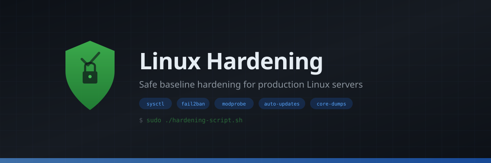

<p align="center">
  
</p>

<p align="center">
  <strong>Safe baseline hardening for production Linux servers</strong>
</p>

<p align="center">
  
  
  
</p>

---

## Overview

A single interactive script that applies widely accepted kernel, network, and userspace hardening defaults to a Linux server. Every destructive or opinionated action is behind a **y/n prompt** — nothing changes without your explicit consent.

The script intentionally **does not** configure firewalls or SSH. Those choices depend on your workload and access model and are best handled separately.

## Quick Start

```bash
git clone https://github.com/Turtlecute33/Hardening-linux-script.git
cd Hardening-linux-script
chmod +x hardening-script.sh
sudo ./hardening-script.sh
```

## Features

| Feature | Details | Prompted? |
|---|---|:---:|
| **Sysctl hardening** | Kernel pointer restriction, dmesg restriction, ptrace scope, symlink/hardlink protection, SYN cookies, ICMP hardening, source route blocking, martian logging | No (always applied) |
| **CUPS removal** | Purges printing packages and disables `cups` / `cups-browsed` services | Yes |
| **Bluetooth disable** | Stops and disables `bluetooth.service` | Yes |
| **Kernel module blacklist** | Blocks unused filesystem modules: cramfs, freevxfs, jffs2, hfs, hfsplus, udf | Yes (default: yes) |
| **USB storage disable** | Prevents loading `usb-storage` module | Yes (default: no) |
| **Core dump restriction** | Configures `limits.conf`, sysctl, and `systemd-coredump` to drop all core dumps | Yes (default: yes) |
| **Automatic security updates** | Configures `unattended-upgrades` (Debian/Ubuntu) or `dnf-automatic` (RHEL/Fedora) | Yes (default: yes) |
| **fail2ban** | Installs and enables fail2ban for brute-force protection | Yes (default: yes) |

## Supported Distributions

- **Debian / Ubuntu** (apt)
- **RHEL / Fedora / CentOS** (dnf)
- **Arch Linux** (pacman)

## Requirements

- Root privileges (`sudo`)
- `systemd`-based system
- `bash`

## What It Does NOT Do

- Configure a firewall (`iptables`, `nftables`, `ufw`)
- Modify SSH or `sshd_config`
- Apply aggressive network settings that could break VPNs, containers, or IPv6 autoconfiguration
- Make changes without asking first (except safe sysctl defaults)

## How It Works

All configuration is written to **drop-in files** — existing system configs are never overwritten:

```
/etc/sysctl.d/99-hardening-baseline.conf    # Kernel & network tunables
/etc/modprobe.d/hardening-blacklist.conf     # Module blacklist
/etc/security/limits.d/99-hardening-no-coredump.conf  # Core dump limits
/etc/sysctl.d/99-hardening-coredump.conf     # Core dump sysctl
/etc/systemd/coredump.conf.d/hardening.conf  # systemd-coredump override
```

To revert any change, simply delete the corresponding drop-in file and reload (`sysctl --system`, etc.).

## Testing

A test suite is included in `tests/`:

```bash
bash tests/test_hardening_script.sh
```

## License

See [LICENSE](LICENSE) for details.
